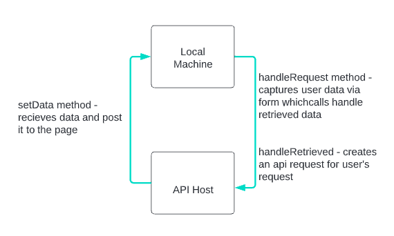
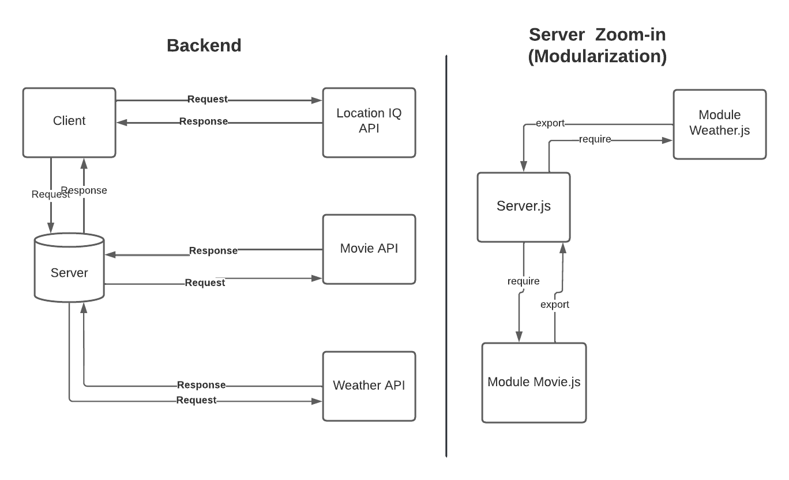
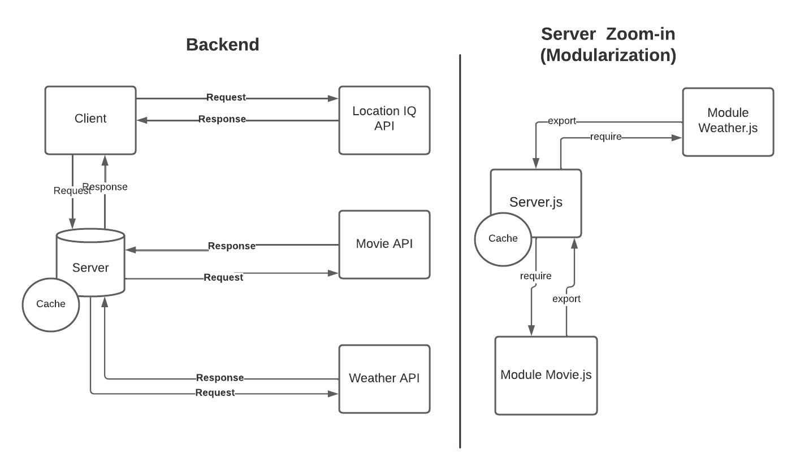

# Project Name: City Explorer

**Author**: Gina
**Version**: 1.0.0 (increment the patch/fix version number if you make more commits past your first submission)

## Overview
A React application that uses the Axios library to make user-initiated requests for data based on a specific location.

## Getting Started
What you'll need:
* Your api keys
* A code editor (such as VS Code)
* Node, NPM, NVM, React & Axios installed
* Web Browser (recommend Google Chrome)

## Architecture

The following diagram(s) depict how data will flow for this project:

### Updated Web request-response cycle for lab 07

### Updated Web request-response cycle for lab 08

### Updated Web request-response cycle for lab 09

### Updated Web request-response cycle for lab 10

## Change Log
<!-- Use this area to document the iterative changes made to your application as each feature is successfully implemented. Use time stamps. Here's an example:

01-01-2001 4:59pm - Application now has a fully-functional express server, with a GET route for the location resource. -->

## Credit and Collaborations
<!-- Give credit (and a link) to other people or resources that helped you build this application. -->
* Collaborated on the Web request-response cycle for lab 07 with [Chad](https://github.com/thryce86)

* Collaborated on the Web request-response cycle for lab 08 with [Chad](https://github.com/thryce86)

* Collaborated on the Web request-response cycle for lab 09 with D. Owens & [J. Rumsey](https://github.com/nojronatron)

* Collaborated on the Web request-response cycle for lab 10 with A. Hill

## Feature List

### Feature 1
Build a React application that uses the Axios library to make user-initiated requests for data from a third-party API.

Estimate of time needed to complete: 5
Start time: 1:00am
Finish time: 11:00am (Next Day)
Actual time needed to complete: 5

### Feature 2
Build a React application that uses the Axios library to make user-initiated requests for data from a third-party API.

Estimate of time needed to complete: 4
Start time: 11:50am
Finish time: 
Actual time needed to complete: 

